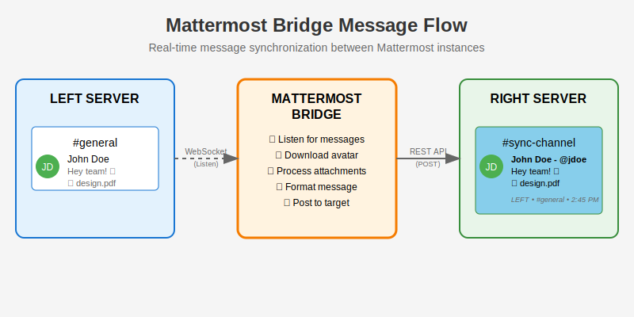
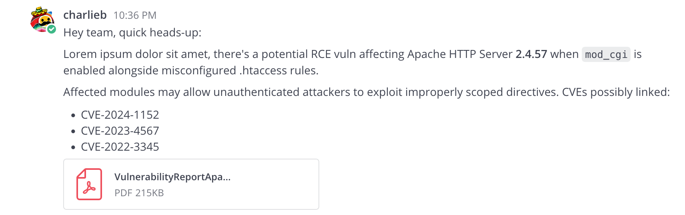
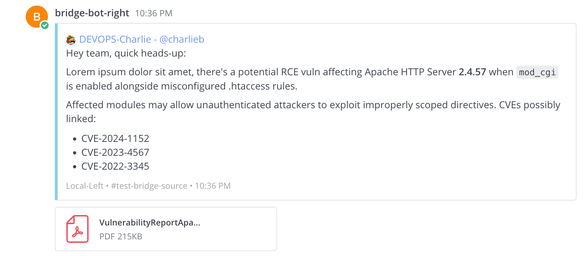
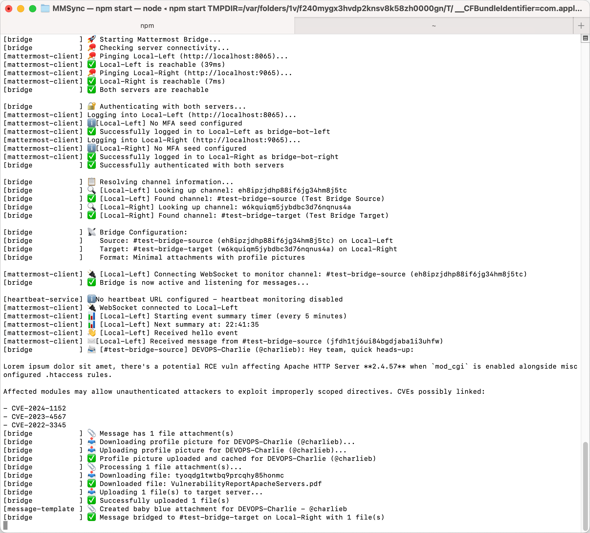

# Mattermost Bridge

A TypeScript-based bridge that forwards messages between channels on different Mattermost instances. Uses regular user accounts for authentication - no bot setup required!

## Flow



## Screenshots

The left mattermost (the one we want to monitor messages on) has a user posting a message:



The bridge will mirror the message to the right mattermost (the destination mattermost)



The console / app log



## How It Works


The bridge listens for messages on a source channel and forwards them to a target channel on a different Mattermost instance, preserving:
- User avatars
- File attachments
- Message formatting
- Original context (timestamp, channel, server)

## Features

- **Cross-server messaging** - Bridge channels between any two Mattermost instances
- **Profile picture sync** - Downloads and re-uploads user avatars with intelligent caching
- **File attachment support** - Seamlessly forwards all file attachments
- **MFA/2FA support** - Works with multi-factor authentication enabled accounts
- **Email domain filtering** - Exclude messages from specific email domains
- **Minimal attachments** - Clean, baby blue message formatting with profile pictures

## Quick Start

```bash
# Clone and setup
git clone <repository-url>
cd mattermost-bridge
npm install

# Run quick setup
./quick-start.sh
```

## Configuration

The bridge uses environment variables for configuration. You can set these in a `.env` file or as environment variables in your deployment environment.

### Quick Configuration Example

```env
# Required: Mattermost Instances
MATTERMOST_LEFT_NAME=SourceServer
MATTERMOST_LEFT_SERVER=https://mattermost.source.com
MATTERMOST_LEFT_USERNAME=bridge-user@source.com
MATTERMOST_LEFT_PASSWORD_B64=<base64-encoded-password>
MATTERMOST_LEFT_TEAM=team-name

MATTERMOST_RIGHT_NAME=TargetServer
MATTERMOST_RIGHT_SERVER=https://mattermost.target.com
MATTERMOST_RIGHT_USERNAME=bridge-user@target.com
MATTERMOST_RIGHT_PASSWORD_B64=<base64-encoded-password>

# Required: Channel IDs
SOURCE_CHANNEL_ID=abc123def456...
TARGET_CHANNEL_ID=xyz789uvw012...
```

## Environment Variables Reference

| Variable | Description | Required | Default | Example |
|----------|-------------|----------|---------|---------|
| **Left Mattermost (Source)** |
| `MATTERMOST_LEFT_NAME` | Display name for the source server | ✅ | - | `SourceServer` |
| `MATTERMOST_LEFT_SERVER` | URL of the source Mattermost server | ✅ | - | `https://mattermost.source.com` |
| `MATTERMOST_LEFT_USERNAME` | Username for authentication | ✅ | - | `bridge-user@source.com` |
| `MATTERMOST_LEFT_PASSWORD_B64` | Base64-encoded password | ✅ | - | `cGFzc3dvcmQxMjMh` |
| `MATTERMOST_LEFT_TEAM` | Team name (for generating message links) | ✅ | - | `team-name` |
| `MATTERMOST_LEFT_MFA_SEED` | MFA/2FA seed (if MFA enabled) | ❌ | - | `JBSWY3DPEHPK3PXP` |
| **Right Mattermost (Target)** |
| `MATTERMOST_RIGHT_NAME` | Display name for the target server | ✅ | - | `TargetServer` |
| `MATTERMOST_RIGHT_SERVER` | URL of the target Mattermost server | ✅ | - | `https://mattermost.target.com` |
| `MATTERMOST_RIGHT_USERNAME` | Username for authentication | ✅ | - | `bridge-user@target.com` |
| `MATTERMOST_RIGHT_PASSWORD_B64` | Base64-encoded password | ✅ | - | `cGFzc3dvcmQxMjMh` |
| `MATTERMOST_RIGHT_TEAM` | Team name (for message links) | ❌ | - | `team-name` |
| `MATTERMOST_RIGHT_MFA_SEED` | MFA/2FA seed (if MFA enabled) | ❌ | - | `GEZDGNBVGY3TQOJQ` |
| **Bridge Configuration** |
| `SOURCE_CHANNEL_ID` | ID of the channel to monitor | ✅ | - | `abc123def456...` |
| `TARGET_CHANNEL_ID` | ID of the channel to post to | ✅ | - | `xyz789uvw012...` |
| **Logging & Display** |
| `LOG_LEVEL` | Logging verbosity level | ❌ | `info` | `debug`, `info`, `warn`, `error` |
| `DEBUG_WEBSOCKET_EVENTS` | Enable detailed WebSocket event logging | ❌ | `false` | `true` |
| `EVENT_SUMMARY_INTERVAL_MINUTES` | How often to log event summaries | ❌ | `10` | `5` |
| `UPDATE_DM_CHANNEL_HEADER` | Update #mattermost-bridge-status channel | ❌ | `false` | `true` |
| `DISABLE_EMOJI` | Disable emojis in console output | ❌ | `false` | `true` |
| `TIMEZONE` | Timezone for timestamp formatting | ❌ | `UTC` | `Europe/Brussels`, `CET` |
| **Message Filtering** |
| `DONT_FORWARD_FOR` | Comma-separated email domains to exclude | ❌ | - | `@excluded.com,@internal.org` |
| `DRY_RUN` | Log messages without posting to target | ❌ | `false` | `true` |
| **Monitoring** |
| `HEARTBEAT_URL` | URL for uptime monitoring | ❌ | - | `https://heartbeat.uptimerobot.com/...` |
| `HEARTBEAT_INTERVAL_MINUTES` | How often to send heartbeat pings | ❌ | `15` | `5` |
| **Appearance** |
| `FOOTER_ICON` | Custom icon URL for message footers | ❌ | - | `https://example.com/icon.png` |
| `LEFT_MESSAGE_EMOJI` | Emoji to add to original message after bridging | ❌ | - | `envelope_with_arrow`, `white_check_mark` |

### Password Encoding

```bash
node encode-password.js "your-password-here"
```

## Docker

```bash
# Pull and run
docker pull clnio/mattermost-bridge:latest
docker run --env-file .env clnio/mattermost-bridge:latest

# Or use docker-compose
docker-compose up -d
```

Docker images support both AMD64 and ARM64 architectures.

## Local Development

```bash
# Set up local test environment
./local-env-setup.sh

# Start development
npm run dev

# Run tests
npm test
```

### Local URLs
- **Left**: http://localhost:8065/left (user: `left` / `leftpass123!`)
- **Right**: http://localhost:9065/right (user: `right` / `rightpass123!`)

## Troubleshooting

**Authentication Failed**
- Verify base64 encoded passwords
- Check MFA seed if using 2FA
- Ensure user has channel access

**Channel Not Found**
- Verify channel IDs are correct
- Use `mmctl channel search "channel-name" --team "team-name"`

**Debug Mode**
```env
LOG_LEVEL=debug
DEBUG_WEBSOCKET_EVENTS=true
```

## Scripts

- `npm start` - Start the bridge
- `npm run dev` - Development mode
- `npm test` - Run tests
- `./build.sh` - Build Docker image
- `./push-live.sh` - Push to Docker Hub
- `./local-env-setup.sh` - Set up local test environment

## Contributing

1. Fork the repository
2. Create your feature branch
3. Commit your changes
4. Push to the branch
5. Open a Pull Request

## License

MIT License - see the LICENSE file for details.